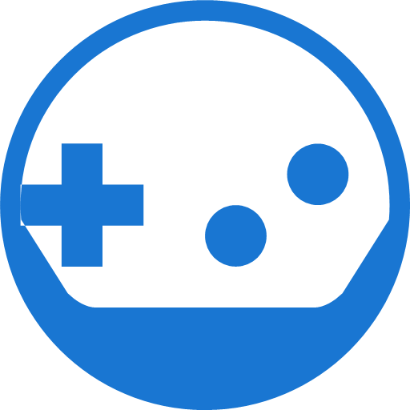

A real-time Android chat application designed for gamers to connect based on shared gaming interests.



## Features

### Authentication & Profile
- Firebase email/password authentication
- Profile customization with avatar upload
- Bio/description editing
- Select favorite games from RAWG API
- Real-time online status tracking

### Social
- Friend requests system
- User search by game preferences
- User profiles with game interests
- Online/offline status with last seen

### Communication
- Real-time private messaging
- Group chats with member management
- Message read receipts
- Real-time updates
- Message timestamps

## Tech Stack

### Frontend
- Native Android (Java)
- Material Design Components
- CircleImageView
- ViewPager2
- RecyclerView

### Backend & APIs
- Firebase
  - Authentication
  - Realtime Database
  - Cloud Storage
- RAWG Gaming API
  - Game search
  - Metadata retrieval

## Prerequisites
- Android Studio
- JDK 11+
- Android SDK API 34
- Firebase account
- RAWG API key

## Installation

1. Clone the repository
```bash
git clone https://github.com/yourusername/game-connect.git
```

2. Firebase Setup
- Create a new Firebase project
- Add Android app to your project
- Download `google-services.json`
- Place in app directory

3. RAWG API Setup
- Get API key from [RAWG](https://rawg.io/apidocs)
- Add to `GameRepository.java`

4. Enable Firebase Services
- Authentication (Email/Password)
- Realtime Database
- Cloud Storage

5. Build and run
```bash
./gradlew build
```

## Security

- Strong password requirements:
  - 8+ characters
  - Uppercase & lowercase
  - Numbers
  - Special characters
  - Secure Firebase rules
  - Connection state management

## Screenshots

### Login Page  


### Sign-up Page  


### Change Email/Password Page  


### Users (Main Tab)  


### Filter Users by Games Page  


### Private Chat  


### Create a Group Page  


### Group Chat Page  


## Acknowledgments

- [Firebase](https://firebase.google.com).
- [RAWG API](https://rawg.io/apidocs).
- [Material Design](https://material.io).
